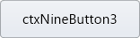
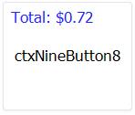
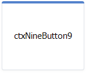
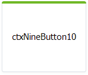
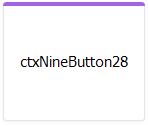

## NPPNG
Nine Patch PNGs for VB6

### Description

NPPNG project includes `cNinePatch.cls` for 9-patch parsing/handling and `ctxNineButton.ctl` custom user-control for transparent animated buttons with states based on 9-patches.

### Supported UI through `Style` property

| Type            | Style                      | Preview                                   |
| --------------- | -------------------------- | ----------------------------------------- |
| Buttons         | Simple buttons                                                        ||
|                 | `ucsBtyButtonDefault`      |    |
|                 | `ucsBtyButtonGreen`        |        |
|                 | `ucsBtyButtonTurnRed`      |    |
| Flat Buttons    | Flat buttons based on bootstrap                                       ||
|                 | `ucsBtyFlatPrimary`        |        |
|                 | `ucsBtyFlatSecondary`      |    |
|                 | `ucsBtyFlatSuccess`        |        |
|                 | `ucsBtyFlatDanger`         |          |
|                 | `ucsBtyFlatWarning`        |        |
|                 | `ucsBtyFlatInfo`           |              |
|                 | `ucsBtyFlatLight`          |            |
|                 | `ucsBtyFlatDark`           |              |
| Outline Buttons | Outline buttons based on boostrap                                     ||
|                 | `ucsBtyOutlinePrimary`     |  |
|                 | `ucsBtyOutlineSecondary`   |  |
|                 | `ucsBtyOutlineSuccess`     |  |
|                 | `ucsBtyOutlineDanger`      |    |
|                 | `ucsBtyOutlineWarning`     |  |
|                 | `ucsBtyOutlineInfo`        |        |
|                 | `ucsBtyOutlineLight`       |      |
|                 | `ucsBtyOutlineDark`        |        |
| Cards           | Static cards that can be owner-drawn with information                 ||
|                 | `ucsBtyCardDefault`        |        |
|                 | `ucsBtyCardPrimary`        |        |
|                 | `ucsBtyCardSuccess`        |        |
|                 | `ucsBtyCardPurple`         |          |

### Supported states

| State                | Description |
| -------------------- | ----------- |
| `ucsBstNormal`       | Normal state |
| `ucsBstHover`        | Optional mouse hover. Otherwise `ucsBstNormal` is used |
| `ucsBstPressed`      | Optional mouse pressed. Otherwise `ucsBstHover` is used |
| `ucsBstHoverPressed` | Optional mouse pressed over the control. Otherwise `ucsBstPressed` is used |
| `ucsBstDisabled`     | Optional disabled state |
| `ucsBstFocused`      | Optional focus rectangle which is composited before current state |

Each state can have a different 9-patch image, text and shadow properties.

### Supported state customization

| Property              | Description |
| --------------------- | ----------- |
| `ButtonImageArray`    | Nine-patch image as byte array |
| `ButtonImageOpacity`  | Image transparency incl. composited text and shadow |
| `ButtonTextFont`      | Text font |
| `ButtonTextFlags`     | Text alignment and wrapping |
| `ButtonTextColor`     | Text color |
| `ButtonTextOpacity`   | Text transparency on image before applying image transparency |
| `ButtonTextOffsetX`   | Additional text horizontal offset after alignment |
| `ButtonTextOffsetY`   | Additional text vertical offset after alignment |
| `ButtonShadowColor`   | Text shadow color |
| `ButtonShadowOpacity` | Text shadow transparency on image |
| `ButtonShadowOffsetX` | Shadow horizontal offset from text |
| `ButtonShadowOffsetY` | Shadow vertical offset from text |

### Global customizations

| Property            | Description |
| ------------------- | ----------- |
| `AnimationDuration` | Duration of state transition (in seconds) |
| `Opacity`           | Global control transparency |
| `Enabled`           | Uses disabled state settings to paint control |
